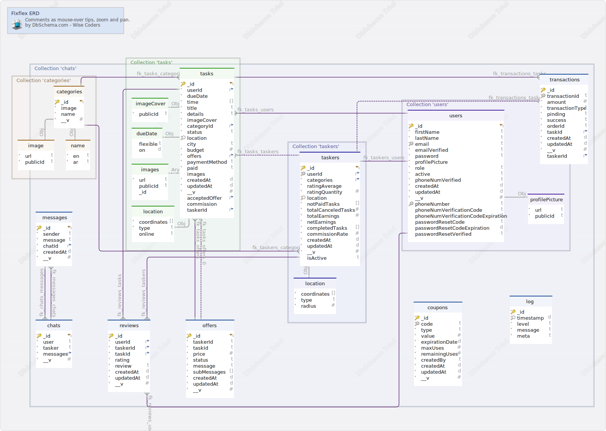

# Mongodb Schema for `fixflex` 🛠️

### Main Layout

### Collection fixflex.categories

| Idx                   | Name           | Data Type |
| --------------------- | -------------- | --------- |
| \* &#128273; &#11019; | \_id           | objectId  |
| \*                    | image          | object    |
| \*                    | image.url      | string    |
| \*                    | image.publicId | string    |
| \*                    | name           | object    |
| \*                    | name.en        | string    |
| \*                    | name.ar        | string    |
| \*                    | \_\_v          | int       |

##### Indexes

| Type      | Name   | On      |
| --------- | ------ | ------- |
| &#128273; | \_id\_ | ON \_id |

### Collection fixflex.chats

| Idx                   | Name     | Data Type |
| --------------------- | -------- | --------- |
| \* &#128273; &#11019; | \_id     | objectId  |
| \*                    | user     | string    |
| \*                    | tasker   | string    |
| \* &#11016;           | messages | array     |
| \*                    | \_\_v    | int       |

##### Indexes

| Type      | Name   | On      |
| --------- | ------ | ------- |
| &#128273; | \_id\_ | ON \_id |

##### Relationships

| Type | Name              | On                                                    |
| ---- | ----------------- | ----------------------------------------------------- |
| Vir  | fk_chats_messages | ( messages ) ref [fixflex.messages](#messages) (\_id) |

### Collection fixflex.coupons

| Idx          | Name           | Data Type |
| ------------ | -------------- | --------- |
| \* &#128273; | \_id           | objectId  |
| \* &#128269; | code           | string    |
| \*           | type           | string    |
| \*           | value          | int       |
| \*           | expirationDate | date      |
| \*           | maxUses        | int       |
| \*           | remainingUses  | int       |
| \*           | createdBy      | string    |
| \*           | createdAt      | date      |
| \*           | updatedAt      | date      |
| \*           | \_\_v          | int       |

##### Indexes

| Type      | Name   | On      |
| --------- | ------ | ------- |
| &#128273; | \_id\_ | ON \_id |
| &#128269; | code_1 | ON code |

### Collection fixflex.log

| Idx          | Name      | Data Type |
| ------------ | --------- | --------- |
| \* &#128273; | \_id      | objectId  |
| \* &#128270; | timestamp | date      |
| \*           | level     | string    |
| \*           | message   | string    |
| \*           | meta      | string    |

##### Indexes

| Type      | Name        | On           |
| --------- | ----------- | ------------ |
| &#128273; | \_id\_      | ON \_id      |
| &#128270; | timestamp_1 | ON timestamp |

### Collection fixflex.messages

| Idx                   | Name      | Data Type |
| --------------------- | --------- | --------- |
| \* &#128273; &#11019; | \_id      | objectId  |
| \*                    | sender    | string    |
| \*                    | message   | string    |
| \* &#11016;           | chatId    | string    |
| \*                    | createdAt | date      |
| \*                    | \_\_v     | int       |

##### Indexes

| Type      | Name   | On      |
| --------- | ------ | ------- |
| &#128273; | \_id\_ | ON \_id |

##### Relationships

| Type | Name              | On                                            |
| ---- | ----------------- | --------------------------------------------- |
| Vir  | fk_messages_chats | ( chatId ) ref [fixflex.chats](#chats) (\_id) |

### Collection fixflex.offers

| Idx                   | Name        | Data Type |
| --------------------- | ----------- | --------- |
| \* &#128273; &#11019; | \_id        | objectId  |
| \*                    | taskerId    | string    |
| \*                    | taskId      | string    |
| \*                    | price       | int       |
| \*                    | status      | string    |
| \*                    | message     | string    |
| \*                    | subMessages | array     |
| \*                    | createdAt   | date      |
| \*                    | updatedAt   | date      |
| \*                    | \_\_v       | int       |

##### Indexes

| Type      | Name   | On      |
| --------- | ------ | ------- |
| &#128273; | \_id\_ | ON \_id |

### Collection fixflex.reviews

| Idx          | Name      | Data Type |
| ------------ | --------- | --------- |
| \* &#128273; | \_id      | objectId  |
| \* &#11016;  | userId    | string    |
| \* &#11016;  | taskerId  | string    |
| \* &#11016;  | taskId    | string    |
| \*           | rating    | object    |
| \*           | review    | string    |
| \*           | createdAt | date      |
| \*           | updatedAt | date      |
| \*           | \_\_v     | int       |

##### Indexes

| Type      | Name   | On      |
| --------- | ------ | ------- |
| &#128273; | \_id\_ | ON \_id |

##### Relationships

| Type | Name               | On                                                  |
| ---- | ------------------ | --------------------------------------------------- |
| Vir  | fk_reviews_users   | ( userId ) ref [fixflex.users](#users) (\_id)       |
| Vir  | fk_reviews_tasks   | ( taskId ) ref [fixflex.tasks](#tasks) (\_id)       |
| Vir  | fk_reviews_taskers | ( taskerId ) ref [fixflex.taskers](#taskers) (\_id) |

### Collection fixflex.taskers

| Idx                   | Name                 | Data Type     |
| --------------------- | -------------------- | ------------- |
| \* &#128273; &#11019; | \_id                 | objectId      |
| \* &#128269; &#11016; | userId               | string        |
| \* &#11016;           | categories           | array[string] |
| \*                    | ratingAverage        | object        |
| \*                    | ratingQuantity       | int           |
| \* &#128270;          | location             | object        |
| \*                    | location.coordinates | array[double] |
| \*                    | location.type        | string        |
| \*                    | location.radius      | int           |
| \*                    | notPaidTasks         | array         |
| \*                    | totalCanceledTasks   | int           |
| \*                    | totalEarnings        | int           |
| \*                    | netEarnings          | object        |
| \*                    | completedTasks       | array         |
| \*                    | commissionRate       | double        |
| \*                    | createdAt            | date          |
| \*                    | updatedAt            | date          |
| \*                    | \_\_v                | int           |
|                       | isActive             | Boolean       |

##### Indexes

| Type      | Name              | On          |
| --------- | ----------------- | ----------- |
| &#128273; | \_id\_            | ON \_id     |
| &#128269; | userId_1          | ON userId   |
| &#128270; | location_2dsphere | ON location |

##### Relationships

| Type | Name                  | On                                                          |
| ---- | --------------------- | ----------------------------------------------------------- |
| Vir  | fk_taskers_users      | ( userId ) ref [fixflex.users](#users) (\_id)               |
| Vir  | fk_taskers_categories | ( categories ) ref [fixflex.categories](#categories) (\_id) |

### Collection fixflex.tasks

| Idx                   | Name                 | Data Type     |
| --------------------- | -------------------- | ------------- |
| \* &#128273; &#11019; | \_id                 | objectId      |
| \* &#11016;           | userId               | string        |
| \*                    | dueDate              | object        |
|                       | dueDate.flexible     | Boolean       |
|                       | dueDate.on           | date          |
| \*                    | time                 | array         |
| \*                    | title                | string        |
| \*                    | details              | string        |
| \*                    | imageCover           | object        |
| \*                    | imageCover.publicId  | string        |
| \* &#11016;           | categoryId           | string        |
| \*                    | status               | string        |
| \* &#128270;          | location             | object        |
| \*                    | location.coordinates | array[double] |
| \*                    | location.type        | string        |
|                       | location.online      | Boolean       |
|                       | city                 | string        |
| \*                    | budget               | int           |
| \* &#11016;           | offers               | array[string] |
| \*                    | paymentMethod        | string        |
| \*                    | paid                 | Boolean       |
|                       | images               | array[object] |
| \*                    | images.url           | string        |
|                       | images.publicId      | string        |
|                       | images.\_id          | objectId      |
| \*                    | createdAt            | date          |
| \*                    | updatedAt            | date          |
| \*                    | \_\_v                | int           |
| &#11016;              | acceptedOffer        | string        |
|                       | commission           | object        |
| &#11016;              | taskerId             | string        |

##### Indexes

| Type      | Name              | On          |
| --------- | ----------------- | ----------- |
| &#128273; | \_id\_            | ON \_id     |
| &#128270; | location_2dsphere | ON location |

##### Relationships

| Type | Name                | On                                                          |
| ---- | ------------------- | ----------------------------------------------------------- |
| Vir  | fk_tasks_offers     | ( offers ) ref [fixflex.offers](#offers) (\_id)             |
| Vir  | fk_tasks_categories | ( categoryId ) ref [fixflex.categories](#categories) (\_id) |
| Vir  | fk_tasks_users      | ( userId ) ref [fixflex.users](#users) (\_id)               |
| Vir  | fk_tasks_taskers    | ( taskerId ) ref [fixflex.taskers](#taskers) (\_id)         |
| Vir  | fk_tasks_offers_0   | ( acceptedOffer ) ref [fixflex.offers](#offers) (\_id)      |

### Collection fixflex.transactions

| Idx          | Name            | Data Type |
| ------------ | --------------- | --------- |
| \* &#128273; | \_id            | objectId  |
| \* &#128269; | transactionId   | string    |
| \*           | amount          | int       |
| \*           | transactionType | string    |
| \*           | pinding         | Boolean   |
| \*           | success         | Boolean   |
| \*           | orderId         | string    |
| \* &#11016;  | taskId          | string    |
| \*           | createdAt       | date      |
| \*           | updatedAt       | date      |
| \*           | \_\_v           | int       |
| &#11016;     | taskerId        | string    |

##### Indexes

| Type      | Name            | On               |
| --------- | --------------- | ---------------- |
| &#128273; | \_id\_          | ON \_id          |
| &#128269; | transactionId_1 | ON transactionId |

##### Relationships

| Type | Name                    | On                                                  |
| ---- | ----------------------- | --------------------------------------------------- |
| Vir  | fk_transactions_tasks   | ( taskId ) ref [fixflex.tasks](#tasks) (\_id)       |
| Vir  | fk_transactions_taskers | ( taskerId ) ref [fixflex.taskers](#taskers) (\_id) |

### Collection fixflex.users

| Idx                   | Name                               | Data Type |
| --------------------- | ---------------------------------- | --------- |
| \* &#128273; &#11019; | \_id                               | objectId  |
| \*                    | firstName                          | string    |
| \*                    | lastName                           | string    |
| \* &#128269;          | email                              | string    |
| \*                    | emailVerified                      | Boolean   |
| \*                    | password                           | string    |
| \*                    | profilePicture                     | object    |
| \*                    | profilePicture.url                 | string    |
| \*                    | profilePicture.publicId            | string    |
| \*                    | role                               | string    |
| \*                    | active                             | Boolean   |
| \*                    | phoneNumVerified                   | Boolean   |
| \*                    | createdAt                          | date      |
| \*                    | updatedAt                          | date      |
| \*                    | \_\_v                              | int       |
| &#128269;             | phoneNumber                        | string    |
|                       | phoneNumVerificationCode           | string    |
|                       | phoneNumVerificationCodeExpiration | date      |
|                       | passwordResetCode                  | string    |
|                       | passwordResetCodeExpiration        | date      |
|                       | passwordResetVerified              | Boolean   |

##### Indexes

| Type      | Name          | On             |
| --------- | ------------- | -------------- |
| &#128273; | \_id\_        | ON \_id        |
| &#128269; | email_1       | ON email       |
| &#128269; | phoneNumber_1 | ON phoneNumber |
